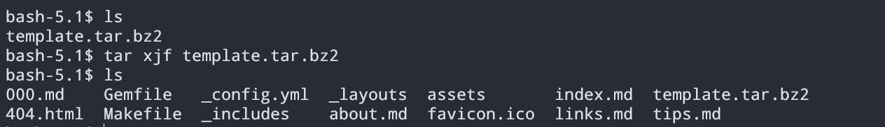
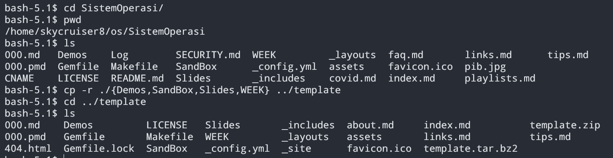
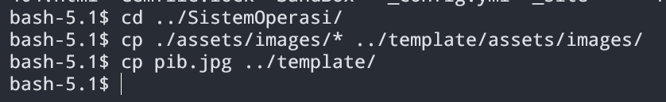
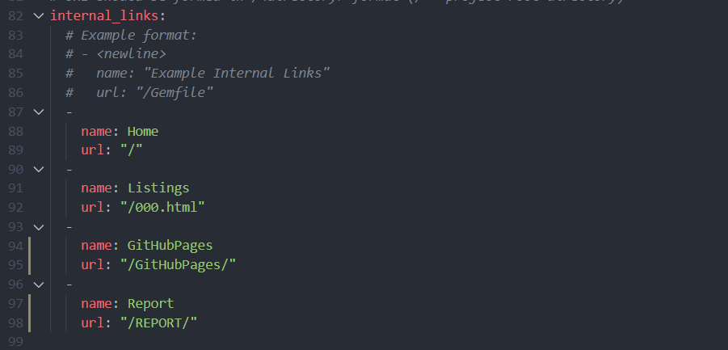
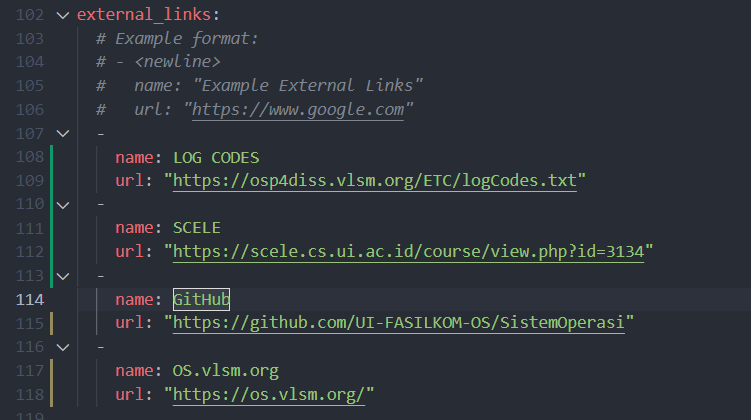

# Migration Guidelines

> Using Template Project, Copying Over Existing Project

1. Extract template from tarball/ZIP.

2. Copy over all files **not related to Jekyll and GitHub Pages** (Markdowns, Jekyll configurations, HTML, CSS, and similar files will be copied later).

3. If intending to fully use the template style, `_includes`, `_layouts`, and `assets` can be left in the existing project (not copied over).
4. Image assets may still need to be copied over, both inside and outside `assets/images` folder.

5. Copy over all **Markdown** and **PMD** files (replace if necessary, MDs resulting from PMD can be left out and recompiled using `make <pmd file>.pmd`).

6. Check all Markdown files for **layout** front matter variable and erase them (_config.yml will take care of it).
7. Check all Markdown files for **site variables**, especially those that are not available in the template. Copy the variables (**not the file**) from existing `_config.yml` to the template's `_config.yml` (*tambal sulam* method).
8. To change the Navbar entry in the template, modify the `internal_links` and `external_links` variable in `_config.yml`.

9. Run `make serve` to test the site in your local machine (assuming that Jekyll is installed). Make adjustments accordingly.